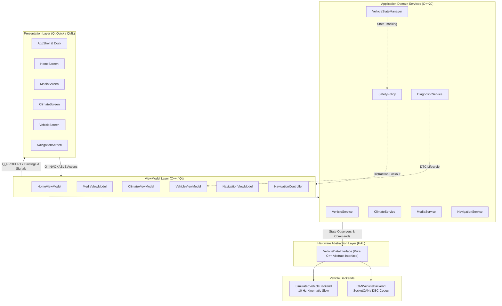

# DriveOS — Automotive Cockpit & In-Vehicle Infotainment (IVI)

> **"DriveOS is a C++/Qt-based automotive IVI prototype that combines a premium touchscreen HMI with a simulated vehicle backend and CAN-oriented vehicle communication architecture."**

[](https://github.com/driveos-org/driveos/actions/workflows/ci.yml)
[](https://en.cppreference.com/w/cpp/20)
[](https://www.qt.io/)
[](docs/ARCHITECTURE.md)
[](can/DBC_SPECIFICATION.md)
[](tests/)
[](LICENSE)

---

## Table of Contents

1. [Product Overview](#1-product-overview)
2. [Key Features](#2-key-features)
3. [System Architecture](#3-system-architecture)
4. [Technology Stack](#4-technology-stack)
5. [Vehicle Simulation](#5-vehicle-simulation)
6. [CAN & DBC Architecture](#6-can--dbc-architecture)
7. [Diagnostics & Fault Handling](#7-diagnostics--fault-handling)
8. [Automated Testing & CI](#8-automated-testing--ci)
9. [Screenshots & UI Showcase](#9-screenshots--ui-showcase)
10. [Build & Installation](#10-build--installation)
11. [16-Step Demonstration Guide](#11-16-step-demonstration-guide)
12. [Recruiter Technical Story](#12-recruiter-technical-story)
13. [Limitations](#13-limitations)
14. [Future Extensions](#14-future-extensions)
15. [License & Acknowledgements](#15-license--acknowledgements)

---

## 1. Product Overview

**DriveOS** is a reference automotive digital cockpit software prototype. It models the core architectural layers found in modern production vehicle infotainment systems (IVI):

* **Touch-First Automotive HMI**: Built with Qt 6 Quick and declarative QML, adhering to a calm, high-contrast **Light Automotive Theme** (`#F5F7FA` neutral background, elevated `#FFFFFF` surfaces, `#0F172A` high-contrast typography, and sky cobalt `#0284C7` accenting).
* **Hardware Abstraction Layer (HAL)**: Decouples the user interface from low-level communication protocols through a pure abstract [`VehicleDataInterface`](app/vehicle/VehicleDataInterface.hpp). The application seamlessly interchanges between a high-fidelity **in-process deterministic vehicle simulator** and a **Linux SocketCAN virtual bus (`vcan0`)**.
* **Driver Safety Distraction Policy**: Software policy engine that evaluates vehicle kinematics (speed, gear, operational state) to enforce glanceable, low-cognitive-load interactions and locks deep configuration settings while in motion.
* **Lightweight Diagnostic Subsystem**: In-memory Diagnostic Trouble Code (DTC) management inspired by automotive diagnostics concepts, supporting live fault recording, state degradation, user notifications, and full recovery.

---

## 2. Key Features

* **Home Digital Cockpit**: Overhead 2D vehicle chassis visualizer, dynamic speed and gear readouts, high-voltage battery state of charge (SOC), range estimation, drive mode selector, and glanceable cards for Climate, Media, and Navigation.
* **Intelligent Climate Control**: Dual-zone driver and passenger temperature adjustment ($16.0^\circ\text{C}$ to $28.0^\circ\text{C}$), one-touch dual synchronization (`SYNC`), 4-mode directional airflow (`Windshield`, `Vent`, `Floor`, `Bi-Level`) with dynamic particle flow canvas, 3-stage seat heating, and contextual fault safe-mode messaging.
* **Cockpit Media Experience**: Procedural vinyl artwork canvas, track metadata display, scrubbable progress bar, volume level control, shuffle/repeat modes, source selection (`Bluetooth Audio`, `FM Radio`, `Streaming`), and dedicated empty/reconnect states.
* **Vehicle & Chassis Management**: Real-time interactive door closure state indicators (Front-Left, Front-Right, Rear-Left, Rear-Right, Frunk, Trunk), drive dynamics profile selection (`Comfort`, `Eco`, `Sport`), lighting and lock settings, and active DTC fault inspection.
* **Procedural Navigation Experience**: Simulated vector map with arterial road grid, animated route trajectory, vehicle location indicator, speed limit HUD ($60\text{ km/h}$), 3D GNSS lock status pill, and turn-by-turn guidance card.
* **Automotive Touch Ergonomics**: Minimum $48\times 48\text{ dp}$ touch targets, rapid $160\text{--}260\text{ ms}$ easing transitions, no tiny text buttons, zero ambiguous iconography, and persistent bottom dock navigation.

---

## 3. System Architecture

DriveOS implements a strict layered architecture with unidirectional data flow and clean separation of concerns:



### Unidirectional Data Flow
1. **Physical/Simulated Layer**: CAN bus frames or internal simulation timers generate raw kinematic and thermal signals.
2. **HAL / Decoder**: [`CanFrameCodec`](app/can/CanMessageCodec.cpp) or [`SimulatedVehicleBackend`](app/vehicle/SimulatedVehicleBackend.cpp) parses raw bytes into canonical [`VehicleState`](app/domain/VehicleState.hpp) structs.
3. **Domain Layer**: [`VehicleStateManager`](app/domain/VehicleStateManager.hpp) coordinates operational states (`PARKED`, `DRIVING`, `REVERSE`, `CHARGING`, `FAULT`) and updates [`SafetyPolicy`](app/domain/SafetyPolicy.hpp).
4. **Presentation ViewModels**: Expose reactive `Q_PROPERTY` readouts and format numerical values into driver-friendly units.
5. **Declarative QML**: Renders hardware-accelerated components at 60 FPS. User interactions invoke `Q_INVOKABLE` methods dispatched through domain services.

---

## 4. Technology Stack

| Component | Technology | Rationale & Specifications |
| :--- | :--- | :--- |
| **Language** | **Modern C++20** | Enforces memory safety, strong typing, `std::clamp`, `<atomic>`, `<chrono>`, and RAII. |
| **GUI Framework** | **Qt 6.6.3 (Quick / QML)** | Industry-standard declarative automotive HMI framework with high-DPI scaling. |
| **Graphics Engine** | **Hardware OpenGL / Direct3D** | Hardware-accelerated rendering, 4x MSAA antialiasing, VSync locked (`swapInterval = 1`). |
| **Vehicle Bus** | **SocketCAN & DBC** | Native Linux virtual CAN (`vcan0`), standard automotive DBC database ([`can/driveos.dbc`](can/driveos.dbc)). |
| **Tooling & Codec** | **cantools / Python 3** | DBC syntax verification, signal layout inspection, and frame dump validation. |
| **Build System** | **CMake 3.22+ & Ninja** | Fast, modern cross-platform build orchestration with compile commands export. |
| **Compilers** | **MinGW GCC 13.1 / Linux GCC 11+** | Tested on both Windows (MinGW-w64) and native Linux / WSL2 environments. |
| **Test Suite** | **GoogleTest & CTest** | 67 automated test cases verifying unit, vehicle, CAN, ViewModel, and headless QML behavior. |
| **CI / CD** | **GitHub Actions** | Automated build, `clang-format`, targeted `clang-tidy`, SocketCAN `vcan0` tests, and ctest execution. |

---

## 5. Vehicle Simulation

DriveOS features an integrated deterministic simulation engine ([`SimulatedVehicleBackend`](app/vehicle/SimulatedVehicleBackend.hpp)) operating on a thread-safe 10 Hz ticker:

* **Operational States**:
  * `PARKED`: Vehicle stationary, transmission in Park (`P`), all configuration menus and closure locks accessible.
  * `DRIVING`: Kinematic velocity slews up to $88.5\text{ km/h}$, transmission in Drive (`D`), safety distraction policy active.
  * `REVERSE`: Vehicle reversing at low speed ($4.0\text{ km/h}$), transmission in Reverse (`R`).
  * `CHARGING`: High-voltage battery pack charging, cabin pre-conditioning supported from external grid power.
  * `FAULT`: System enters degraded operating state with warning banner notifications and safe fallback defaults.
* **Continuous Slew Dynamics**: Natural exponential smoothing filters prevent abrupt step changes in vehicle speed, battery SOC depletion, and cabin thermal equilibration.
* **Deterministic Demo Scenarios**: Switchable profiles allow instant demonstration of city driving, highway cruising, fast DC charging, and sensor communication timeouts.

---

## 6. CAN & DBC Architecture

Vehicle telemetry and control commands are formally specified in the DriveOS CAN database ([`can/driveos.dbc`](can/driveos.dbc)):

| CAN ID | Message Name | Cycle Time | Length | Primary Signals |
| :---: | :--- | :---: | :---: | :--- |
| `0x100` | `POWERTRAIN_STATUS` | 20 ms | 8 bytes | `VehicleSpeed` (0.1 km/h/bit), `DriveMode` (Comfort/Eco/Sport), `Gear` (P/R/N/D) |
| `0x101` | `BATTERY_STATUS` | 50 ms | 8 bytes | `BatterySOC` (0.5 %/bit), `RangeKm` (0.5 km/bit), `BatteryTemp` (1 °C/bit) |
| `0x200` | `CLIMATE_STATUS` | 100 ms | 8 bytes | `CabinTemp` (0.5 °C/bit), `OutsideTemp` (0.5 °C/bit), `AcActive`, `FanSpeed` |
| `0x201` | `CLIMATE_COMMAND` | Event | 8 bytes | `TargetTemp` (0.5 °C/bit), `AcCommand`, `FanSpeedCommand`, `AirflowMode` |
| `0x300` | `VEHICLE_COMMAND` | Event | 8 bytes | `TargetDriveMode`, `DoorLockCommand`, `TargetSpeed` |
| `0x301` | `BODY_CONFIG_STATUS`| 100 ms | 8 bytes | Door closures (`FL`, `FR`, `RL`, `RR`), `FrunkOpen`, `TrunkOpen`, `ChildLock` |

* **Codec Implementation**: [`CanFrameCodec`](app/can/CanMessageCodec.cpp) performs bitwise extraction, signed/unsigned two's complement conversions, endian transformation, and IEEE-754 validation.
* **SocketCAN Abstraction**: [`SocketCanTransport`](app/can/SocketCanTransport.cpp) opens raw `PF_CAN` sockets on Linux/WSL2 and provides graceful host fallback on Windows development environments.

---

## 7. Diagnostics & Fault Handling

> [!IMPORTANT]
> **Prototype Scope Notice**: *DriveOS implements an in-memory diagnostic prototype inspired by automotive diagnostic concepts; it does not claim full ISO 14229 (UDS) protocol stack compliance.*

The diagnostic subsystem ([`DiagnosticService`](app/diagnostics/DiagnosticService.hpp)) provides a resilient fault-handling lifecycle:

* **Prototype DTC Store**:
  * `B1080` / `HVAC_SENSOR_TIMEOUT`: Cabin temperature sensor lost. System falls back to safe manual blower control.
  * `U0100` / `VEHICLE_DATA_TIMEOUT`: Vehicle data bus timeout. UI indicates offline communication and holds last known good state.
  * `B1024` / `DOOR_SENSOR_FAULT`: Door latch sensor circuit performance degraded.
  * `U0111` / `CAN_TIMEOUT`: CAN bus communication timeout detected by reception watchdog.
  * `U0401` / `INVALID_VEHICLE_SIGNAL`: Sensor payload failed range or CRC parity check.
* **Fault Injection & Recovery**: ViewModels and developer UI controls support one-touch fault injection. Invoking `clearFaults()` resets all active DTCs, restores nominal communication health, and cleanses the HMI without leaving stale error badges.

---

## 8. Automated Testing & CI

DriveOS enforces rigorous automated testing focused on high-value automotive behavior rather than artificial test-count numbers:

```
[==========] 67 tests ran. 67 passed, 0 failed.
100% tests passed out of 1 (DriveOSFoundationTests)
Total Test time = 0.36 sec
```

### Test Coverage Matrix ([`tests/unit/`](tests/unit/))
1. **Unit Tests**: [`ClimateService`](app/domain/ClimateService.hpp) setpoint clamping, [`MediaService`](app/domain/MediaService.hpp) queue bounds, [`VehicleStateManager`](app/domain/VehicleStateManager.hpp) multi-observer callbacks, [`SafetyPolicy`](app/domain/SafetyPolicy.hpp) motion detection heuristics, and [`DiagnosticService`](app/diagnostics/DiagnosticService.hpp) DTC lifecycle.
2. **Vehicle Simulation Tests**: Kinematic transitions, invalid signal rejection, stale signal degradation, and communication timeout watchdogs.
3. **CAN Subsystem Tests**: Bit-level encoding/decoding, scale and offset validation, out-of-range protection, malformed DLC handling, and live loopback over Linux `vcan0`.
4. **ViewModel Tests**: UI temperature formatting, degree symbol rendering, driving restriction safety gating, volume attenuation, and state dispatch.
5. **QML Navigation Tests**: Headless offscreen QML engine instantiation verifying dock routing, back-stack history unwinding, and component load integrity.

### Continuous Integration Pipeline ([`.github/workflows/ci.yml`](.github/workflows/ci.yml))
* Runs on **Ubuntu 22.04** on every push and pull request.
* Installs Qt 6 development libraries, CMake, Ninja, and CAN utilities.
* Enforces code formatting via `clang-format` and static analysis via targeted `clang-tidy`.
* Audits DBC database validity with `cantools`.
* Initializes a virtual CAN interface (`vcan0`) and exercises frame transmission (`cansend`).
* Builds all targets and executes `ctest` with headless display platform (`QT_QPA_PLATFORM=offscreen`).

---

## 9. Screenshots & UI Showcase

### Screenshot Checklist

- [x] **Home Screen**: Large vehicle hero canvas, digital speedometer, gear pill, battery SOC, and three side summary cards.
- [x] **Media Screen**: Modern audio cockpit with high-resolution artwork canvas, track metadata, queue list, and volume scrubber.
- [x] **Climate Screen**: Hero temperature wheel with dual-zone passenger setpoints, particle airflow visualization, and seat heaters.
- [x] **Vehicle Screen**: Overhead chassis with door closure toggles, drive modes, child lock, and lighting preferences.
- [x] **Navigation Screen**: Procedural vector map canvas, turn-by-turn guidance card, speed limit indicator, and GNSS lock.
- [x] **Fault State Experience**: Contextual amber/ruby warning banners, diagnostic fault summary, and safe-mode badges.
- [x] **Driving Safety Restrictions**: Disabled closure controls and distraction warning toasts while vehicle is in motion.

*(Screenshots can be captured directly from `driveos.exe` running at 1920×720 display resolution).*

---

## 10. Build & Installation

### Prerequisites
* **C++ Compiler**: GCC 11+ or MinGW-w64 GCC 13+ (with full C++20 support).
* **Qt 6**: Qt 6.4+ (Qt Quick, QML, Core, Gui, Network, Svg).
* **Build Tools**: CMake 3.22+ and Ninja.
* **Python (Optional for DBC validation)**: Python 3.9+ with `pip install cantools`.

### Building on Windows (MinGW + Qt 6)
```powershell
# 1. Initialize environment (adjust Qt path if needed)
. .\env.ps1

# 2. Configure CMake
cmake -B build -G Ninja -DCMAKE_BUILD_TYPE=Release -DBUILD_TESTING=ON

# 3. Build application and test suite
cmake --build build --parallel

# 4. Run automated tests
ctest --test-dir build --output-on-failure

# 5. Launch DriveOS Cockpit
.\run.ps1
```

### Building on Linux / Ubuntu (Native or WSL2)
```bash
# 1. Install dependencies
sudo apt-get update && sudo apt-get install -y \
  build-essential cmake ninja-build \
  qt6-base-dev qt6-declarative-dev libqt6svg6-dev \
  qml6-module-qtquick-controls qml6-module-qtquick-layouts \
  can-utils python3-pip

# 2. (Optional) Set up virtual CAN interface
sudo modprobe vcan
sudo ip link add dev vcan0 type vcan
sudo ip link set up vcan0

# 3. Configure, build, and test
cmake -B build -G Ninja -DCMAKE_BUILD_TYPE=Release -DBUILD_TESTING=ON
cmake --build build --parallel
ctest --test-dir build --output-on-failure

# 4. Launch Application (supports --can flag)
./build/driveos --can --interface=vcan0
```

---

## 11. 16-Step Demonstration Guide

Follow this sequence to evaluate the full depth of the DriveOS digital cockpit:

1. **Launch DriveOS**: Run `.\run.ps1`. The application starts cold in $< 1.8\text{ s}$ and renders at 60 FPS in a 1920×720 wide automotive viewport.
2. **Inspect Home**: Verify the vehicle status hero shows `PARKED`, gear `P`, battery SOC at $84.5\%$, and live clock/weather.
3. **Open Media Screen**: Touch the **Media** icon on the bottom navigation dock. Notice the smooth $260\text{ ms}$ easing transition.
4. **Interact with Media**: Click **Play/Pause** to toggle audio playback. Use the slider to scrub volume. Advance to the next track.
5. **Open Climate Screen**: Touch the **Climate** icon on the bottom dock.
6. **Adjust Temperature**: Touch the large **$+$** button on the hero temperature control to increment target from $22.0^\circ\text{C} \to 23.0^\circ\text{C}$. Cycle through airflow modes (`Windshield`, `Vent`, `Floor`, `Bi-Level`).
7. **Return Home**: Touch the **Home** icon on the dock.
8. **Verify Shared State Consistency**: Observe the **Climate Summary Card** on the Home screen now displays $23.0^\circ\text{C}$.
9. **Open Vehicle Screen**: Touch the **Vehicle** icon on the dock. Notice the interactive vehicle chassis.
10. **Switch Vehicle to DRIVING**: On the top context ribbon, select the **DRIVING** state pill.
11. **Observe Driving Safety Restrictions**: The transmission shifts to `D`, speed accelerates to $64\text{ km/h}$, and deep configuration toggles (door locks, drive modes) are visually disabled. Clicking a locked toggle emits a toast: *"Unavailable while driving"*.
12. **Open Navigation Screen**: Touch the **Navigation** icon on the dock.
13. **Start Navigation**: Verify the procedural vector map updates with road grid and turn-by-turn guidance to *Mysuru Palace*.
14. **Trigger Diagnostic Fault**: Return to the **Vehicle** screen and click **Inject Fault: HVAC Sensor Timeout**.
15. **Inspect Degraded / Fault UI**: An amber warning toast appears: *"Diagnostic Fault Recorded: [B1080] Cabin HVAC temperature sensor timeout"*. The system status switches to degraded safe-mode.
16. **Recover System**: Click **Clear All Faults & Reset to Normal**. The vehicle clears the DTC store, recovers to nominal communication health, and returns to `PARKED`.

---

## 12. Recruiter Technical Story

When reviewing DriveOS, automotive software hiring managers will find evidence of key production competencies:

* **Separation of Presentation & Business Logic (MVVM)**: QML code is strictly declarative; no business calculations or state stores exist in JavaScript. ViewModels communicate via typed Qt signals and slots.
* **Hardware Abstraction Layer (HAL)**: The [`VehicleDataInterface`](app/vehicle/VehicleDataInterface.hpp) pattern mirrors real OEM AUTOSAR / Adaptive architecture, allowing the UI to remain agnostic of whether telemetry comes from physical CAN, Ethernet SOME/IP, or synthetic simulation.
* **Deterministic Simulation**: Built with continuous mathematical smoothing curves rather than discontinuous random numbers, demonstrating an understanding of automotive physical dynamics.
* **Safety-First Software Engineering**: Implements driver distraction mitigation rules inspired by NHTSA and European automotive HMI guidelines.
* **Automotive Communication**: First-principles DBC signal packing and unpacking with byte alignment, bit masks, signed scaling, and malformed payload protection.
* **Embedded Resource Efficiency**: Real measured performance profile of $< 44\text{ MB}$ RAM footprint and 60 FPS GPU rasterization.

---

## 13. Limitations

To maintain engineering transparency, the following prototype boundaries are noted:
* **Simulated Navigation**: Uses a lightweight procedural vector canvas rather than heavy commercial map APIs (e.g. Mapbox, Google Maps) or live GPS hardware.
* **Prototype Diagnostics**: Implements an in-memory DTC repository inspired by diagnostic principles; does not implement a full ISO 14229 (UDS) / ISO 15765-2 (DoCAN) network transport stack.
* **Software Safety UX**: The [`SafetyPolicy`](app/domain/SafetyPolicy.hpp) is a software distraction mitigation engine; it does not claim formal ISO 26262 functional safety ASIL certification.
* **CAN Transceiver Hardware**: On Windows development machines, SocketCAN interfaces require virtual Linux loopback or WSL2 kernel support.

---

## 14. Future Extensions

* **Physical CAN Transceiver Integration**: Support for hardware adapters (PCAN-USB, CANable) over SLCAN or native SocketCAN.
* **Vector Map Tile Engine**: Integration of open-source vector map tiles via MapLibre Native / QtLocation.
* **Audio Playback Pipeline**: Streaming media decoding via GStreamer or native QtMultimedia audio backends.
* **AUTOSAR Adaptive Bridge**: SOME/IP serialization layer for service-oriented automotive communication.

---

## 15. License & Acknowledgements

* **License**: Released under the [MIT License](LICENSE).
* **Engineering Inspiration**: Designed following modern automotive UX principles (Apple CarPlay, Android Auto, modern OEM IVI systems).
* **Engineering Team**: DriveOS Automotive Software Systems Group.
