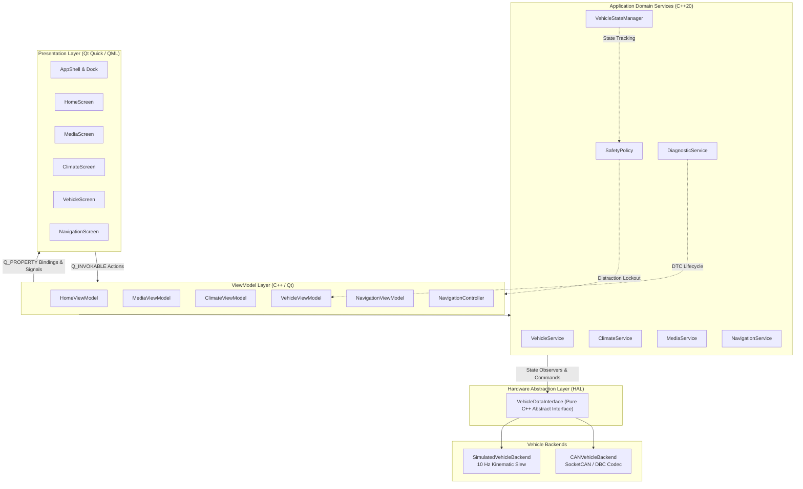

# DriveOS — Automotive Cockpit & In-Vehicle Infotainment (IVI)

> **"DriveOS is a C++/Qt-based automotive IVI prototype that combines a premium touchscreen HMI with a simulated vehicle backend and CAN-oriented vehicle communication architecture."**


## Table of Contents

1. [Product Overview](#1-product-overview)
2. [Key Features](#2-key-features)
3. [System Architecture](#3-system-architecture)
4. [Technology Stack](#4-technology-stack)
5. [Vehicle Simulation](#5-vehicle-simulation)
6. [CAN & DBC Architecture](#6-can--dbc-architecture)
7. [Diagnostics & Fault Handling](#7-diagnostics--fault-handling)
8. [Build & Installation](#10-build--installation)

---

## 1. Product Overview

**DriveOS** is a reference automotive digital cockpit software prototype. It models the core architectural layers found in modern production vehicle infotainment systems (IVI):

* **Touch-First Automotive HMI**: Built with Qt 6 Quick and declarative QML, adhering to a calm, high-contrast **Light Automotive Theme** (`#F5F7FA` neutral background, elevated `#FFFFFF` surfaces, `#0F172A` high-contrast typography, and sky cobalt `#0284C7` accenting).
* **Hardware Abstraction Layer (HAL)**: Decouples the user interface from low-level communication protocols through a pure abstract [`VehicleDataInterface`](app/vehicle/VehicleDataInterface.hpp). The application seamlessly interchanges between a high-fidelity **in-process deterministic vehicle simulator** and a **Linux SocketCAN virtual bus (`vcan0`)**.
* **Driver Safety Distraction Policy**: Software policy engine that evaluates vehicle kinematics (speed, gear, operational state) to enforce glanceable, low-cognitive-load interactions and locks deep configuration settings while in motion.
* **Lightweight Diagnostic Subsystem**: In-memory Diagnostic Trouble Code (DTC) management inspired by automotive diagnostics concepts, supporting live fault recording, state degradation, user notifications, and full recovery.

---

## 2. Key Features

* **Home Digital Cockpit**: Overhead 2D vehicle chassis visualizer, dynamic speed and gear readouts, high-voltage battery state of charge (SOC), range estimation, drive mode selector, and glanceable cards for Climate, Media, and Navigation.
* **Intelligent Climate Control**: Dual-zone driver and passenger temperature adjustment ($16.0^\circ\text{C}$ to $28.0^\circ\text{C}$), one-touch dual synchronization (`SYNC`), 4-mode directional airflow (`Windshield`, `Vent`, `Floor`, `Bi-Level`) with dynamic particle flow canvas, 3-stage seat heating, and contextual fault safe-mode messaging.
* **Cockpit Media Experience**: Procedural vinyl artwork canvas, track metadata display, scrubbable progress bar, volume level control, shuffle/repeat modes, source selection (`Bluetooth Audio`, `FM Radio`, `Streaming`), and dedicated empty/reconnect states.
* **Vehicle & Chassis Management**: Real-time interactive door closure state indicators (Front-Left, Front-Right, Rear-Left, Rear-Right, Frunk, Trunk), drive dynamics profile selection (`Comfort`, `Eco`, `Sport`), lighting and lock settings, and active DTC fault inspection.
* **Procedural Navigation Experience**: Simulated vector map with arterial road grid, animated route trajectory, vehicle location indicator, speed limit HUD ($60\text{ km/h}$), 3D GNSS lock status pill, and turn-by-turn guidance card.
* **Automotive Touch Ergonomics**: Minimum $48\times 48\text{ dp}$ touch targets, rapid $160\text{--}260\text{ ms}$ easing transitions, no tiny text buttons, zero ambiguous iconography, and persistent bottom dock navigation.

---

## 3. System Architecture

DriveOS implements a strict layered architecture with unidirectional data flow and clean separation of concerns:



### Unidirectional Data Flow
1. **Physical/Simulated Layer**: CAN bus frames or internal simulation timers generate raw kinematic and thermal signals.
2. **HAL / Decoder**: [`CanFrameCodec`](app/can/CanMessageCodec.cpp) or [`SimulatedVehicleBackend`](app/vehicle/SimulatedVehicleBackend.cpp) parses raw bytes into canonical [`VehicleState`](app/domain/VehicleState.hpp) structs.
3. **Domain Layer**: [`VehicleStateManager`](app/domain/VehicleStateManager.hpp) coordinates operational states (`PARKED`, `DRIVING`, `REVERSE`, `CHARGING`, `FAULT`) and updates [`SafetyPolicy`](app/domain/SafetyPolicy.hpp).
4. **Presentation ViewModels**: Expose reactive `Q_PROPERTY` readouts and format numerical values into driver-friendly units.
5. **Declarative QML**: Renders hardware-accelerated components at 60 FPS. User interactions invoke `Q_INVOKABLE` methods dispatched through domain services.

---

## 4. Technology Stack

| Component | Technology | Rationale & Specifications |
| :--- | :--- | :--- |
| **Language** | **Modern C++20** | Enforces memory safety, strong typing, `std::clamp`, `<atomic>`, `<chrono>`, and RAII. |
| **GUI Framework** | **Qt 6.6.3 (Quick / QML)** | Industry-standard declarative automotive HMI framework with high-DPI scaling. |
| **Graphics Engine** | **Hardware OpenGL / Direct3D** | Hardware-accelerated rendering, 4x MSAA antialiasing, VSync locked (`swapInterval = 1`). |
| **Vehicle Bus** | **SocketCAN & DBC** | Native Linux virtual CAN (`vcan0`), standard automotive DBC database ([`can/driveos.dbc`](can/driveos.dbc)). |
| **Tooling & Codec** | **cantools / Python 3** | DBC syntax verification, signal layout inspection, and frame dump validation. |
| **Build System** | **CMake 3.22+ & Ninja** | Fast, modern cross-platform build orchestration with compile commands export. |
| **Compilers** | **MinGW GCC 13.1 / Linux GCC 11+** | Tested on both Windows (MinGW-w64) and native Linux / WSL2 environments. |
| **Test Suite** | **GoogleTest & CTest** | 67 automated test cases verifying unit, vehicle, CAN, ViewModel, and headless QML behavior. |
| **CI / CD** | **GitHub Actions** | Automated build, `clang-format`, targeted `clang-tidy`, SocketCAN `vcan0` tests, and ctest execution. |

---

## 5. Vehicle Simulation

DriveOS features an integrated deterministic simulation engine ([`SimulatedVehicleBackend`](app/vehicle/SimulatedVehicleBackend.hpp)) operating on a thread-safe 10 Hz ticker:

* **Operational States**:
  * `PARKED`: Vehicle stationary, transmission in Park (`P`), all configuration menus and closure locks accessible.
  * `DRIVING`: Kinematic velocity slews up to $88.5\text{ km/h}$, transmission in Drive (`D`), safety distraction policy active.
  * `REVERSE`: Vehicle reversing at low speed ($4.0\text{ km/h}$), transmission in Reverse (`R`).
  * `CHARGING`: High-voltage battery pack charging, cabin pre-conditioning supported from external grid power.
  * `FAULT`: System enters degraded operating state with warning banner notifications and safe fallback defaults.
* **Continuous Slew Dynamics**: Natural exponential smoothing filters prevent abrupt step changes in vehicle speed, battery SOC depletion, and cabin thermal equilibration.
* **Deterministic Demo Scenarios**: Switchable profiles allow instant demonstration of city driving, highway cruising, fast DC charging, and sensor communication timeouts.

---

## 6. CAN & DBC Architecture

Vehicle telemetry and control commands are formally specified in the DriveOS CAN database ([`can/driveos.dbc`](can/driveos.dbc)):

| CAN ID | Message Name | Cycle Time | Length | Primary Signals |
| :---: | :--- | :---: | :---: | :--- |
| `0x100` | `POWERTRAIN_STATUS` | 20 ms | 8 bytes | `VehicleSpeed` (0.1 km/h/bit), `DriveMode` (Comfort/Eco/Sport), `Gear` (P/R/N/D) |
| `0x101` | `BATTERY_STATUS` | 50 ms | 8 bytes | `BatterySOC` (0.5 %/bit), `RangeKm` (0.5 km/bit), `BatteryTemp` (1 °C/bit) |
| `0x200` | `CLIMATE_STATUS` | 100 ms | 8 bytes | `CabinTemp` (0.5 °C/bit), `OutsideTemp` (0.5 °C/bit), `AcActive`, `FanSpeed` |
| `0x201` | `CLIMATE_COMMAND` | Event | 8 bytes | `TargetTemp` (0.5 °C/bit), `AcCommand`, `FanSpeedCommand`, `AirflowMode` |
| `0x300` | `VEHICLE_COMMAND` | Event | 8 bytes | `TargetDriveMode`, `DoorLockCommand`, `TargetSpeed` |
| `0x301` | `BODY_CONFIG_STATUS`| 100 ms | 8 bytes | Door closures (`FL`, `FR`, `RL`, `RR`), `FrunkOpen`, `TrunkOpen`, `ChildLock` |

* **Codec Implementation**: [`CanFrameCodec`](app/can/CanMessageCodec.cpp) performs bitwise extraction, signed/unsigned two's complement conversions, endian transformation, and IEEE-754 validation.
* **SocketCAN Abstraction**: [`SocketCanTransport`](app/can/SocketCanTransport.cpp) opens raw `PF_CAN` sockets on Linux/WSL2 and provides graceful host fallback on Windows development environments.

---

## 7. Diagnostics & Fault Handling

The diagnostic subsystem ([`DiagnosticService`](app/diagnostics/DiagnosticService.hpp)) provides a resilient fault-handling lifecycle:

* **Prototype DTC Store**:
  * `B1080` / `HVAC_SENSOR_TIMEOUT`: Cabin temperature sensor lost. System falls back to safe manual blower control.
  * `U0100` / `VEHICLE_DATA_TIMEOUT`: Vehicle data bus timeout. UI indicates offline communication and holds last known good state.
  * `B1024` / `DOOR_SENSOR_FAULT`: Door latch sensor circuit performance degraded.
  * `U0111` / `CAN_TIMEOUT`: CAN bus communication timeout detected by reception watchdog.
  * `U0401` / `INVALID_VEHICLE_SIGNAL`: Sensor payload failed range or CRC parity check.
* **Fault Injection & Recovery**: ViewModels and developer UI controls support one-touch fault injection. Invoking `clearFaults()` resets all active DTCs, restores nominal communication health, and cleanses the HMI without leaving stale error badges.

---

## 8. Build & Installation

### Prerequisites
* **C++ Compiler**: GCC 11+ or MinGW-w64 GCC 13+ (with full C++20 support).
* **Qt 6**: Qt 6.4+ (Qt Quick, QML, Core, Gui, Network, Svg).
* **Build Tools**: CMake 3.22+ and Ninja.
* **Python (Optional for DBC validation)**: Python 3.9+ with `pip install cantools`.

### Building on Windows (MinGW + Qt 6)
```powershell
# 1. Initialize environment (adjust Qt path if needed)
. .\env.ps1

# 2. Configure CMake
cmake -B build -G Ninja -DCMAKE_BUILD_TYPE=Release -DBUILD_TESTING=ON

# 3. Build application and test suite
cmake --build build --parallel

# 4. Run automated tests
ctest --test-dir build --output-on-failure

# 5. Launch DriveOS Cockpit
.\run.ps1
```

### Building on Linux / Ubuntu (Native or WSL2)
```bash
# 1. Install dependencies
sudo apt-get update && sudo apt-get install -y \
  build-essential cmake ninja-build \
  qt6-base-dev qt6-declarative-dev libqt6svg6-dev \
  qml6-module-qtquick-controls qml6-module-qtquick-layouts \
  can-utils python3-pip

# 2. (Optional) Set up virtual CAN interface
sudo modprobe vcan
sudo ip link add dev vcan0 type vcan
sudo ip link set up vcan0

# 3. Configure, build, and test
cmake -B build -G Ninja -DCMAKE_BUILD_TYPE=Release -DBUILD_TESTING=ON
cmake --build build --parallel
ctest --test-dir build --output-on-failure

# 4. Launch Application (supports --can flag)
./build/driveos --can --interface=vcan0
```

---

