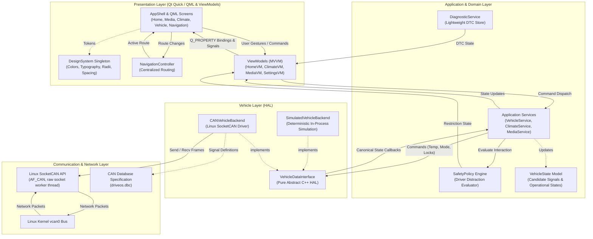
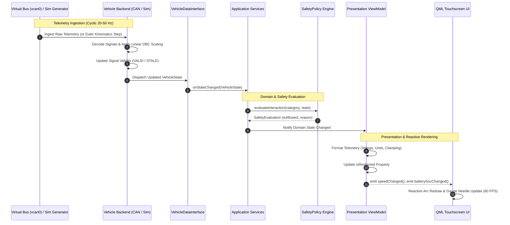
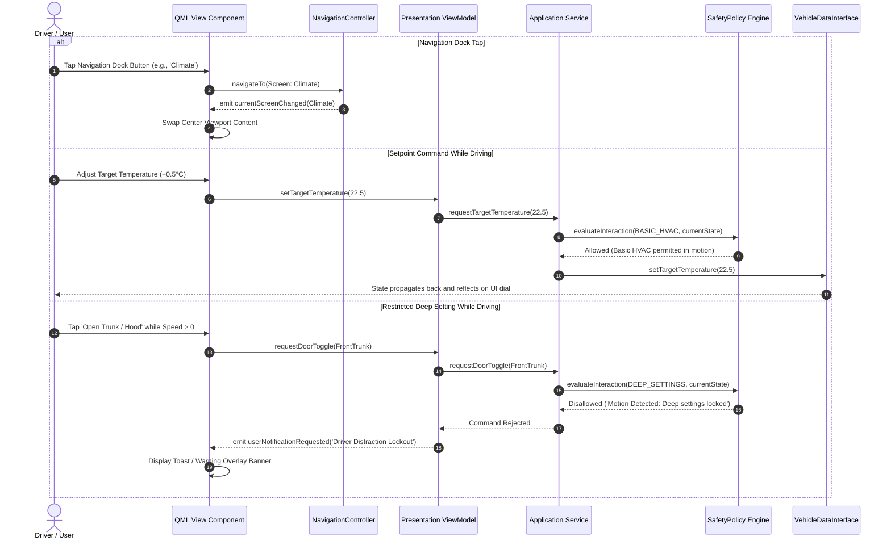
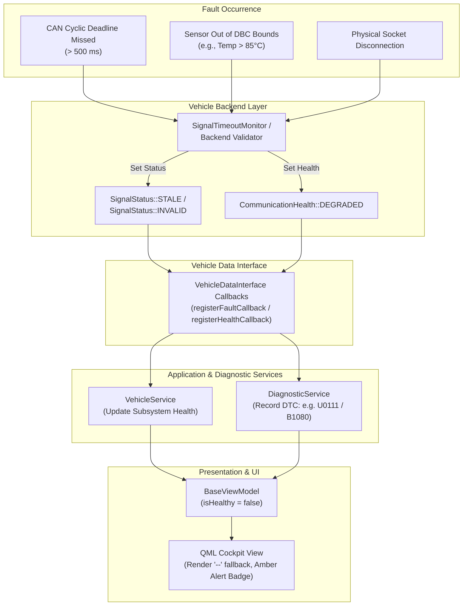

# DriveOS — Architectural System Diagrams

This document illustrates the practical software architecture of DriveOS via Mermaid diagrams.

---

## 1. System Architecture Diagram

---

## 2. Vehicle Data Flow Diagram

---

## 3. UI Data Flow & User Interaction Diagram

---

## 4. Fault Propagation Diagram

