# DriveOS — Automotive IVI & Vehicle HMI
## Development Environment Inspection & Toolchain Strategy

---

### 1. Document Overview

This document records the empirical results of the workspace and toolchain inspection conducted during **Phase 0**. It details the host machine's hardware and operating system profile, current software availability, missing dependencies, and the strategic path forward to support both local development and native Linux SocketCAN validation.

> [!NOTE]
> In strict accordance with Phase 0 instructions, **no large software packages, compilers, or Qt frameworks were silently or automatically installed**. The findings below reflect the actual state of the system at inspection.

---

### 2. Empirical Host Environment Baseline

| System Property | Detected Value | Verification Method |
| :--- | :--- | :--- |
| **Operating System** | **Microsoft Windows 11 Home Single Language** (Build 10.0.26200, 64-bit) | `Win32_OperatingSystem` CIM Query |
| **Host System RAM** | **24.0 GB Total** (~5.8 GB Visible Free at inspection) | `Win32_OperatingSystem` CIM Query |
| **Drive D: Capacity** | **64.9 GB Free** (54.2 GB Used) | `Get-PSDrive D` |
| **Default Shell** | Windows PowerShell 5.1 / PowerShell Core | `$PSVersionTable` |
| **Package Manager** | `winget` (Windows Package Manager v1.29.380) | `winget --version` |
| **Version Control** | `git version 2.52.0.windows.1` | `git --version` |
| **Git Identity** | `DriveOS Engineering <driveos-dev@users.noreply.github.com>` | `git config --list` |
| **Python Runtime** | `Python 3.13.7` (pip 26.1.2) | `python --version`, `pip --version` |
| **Fast Package Manager** | `uv 0.10.6` (`%USERPROFILE%\.local\bin\uv.exe`) | `uv --version` |

---

### 3. Detailed Toolchain Inventory & Gap Analysis

| Tool / Dependency | Detected Status | Required Role in DriveOS | Classification | Recommended Next Action |
| :--- | :---: | :--- | :---: | :--- |
| **Git** | **Present (2.52.0)** | Repository version control and tracking | Mandatory | Initialized repository during Phase 1 |
| **Python** | **Present (3.13.7)** | Test harnesses, DBC tools, scripting | Mandatory | Keep host Python for CLI scripts |
| **uv** | **Present (0.10.6)** | Fast Python package management | Optional | Use for fast local `cantools` setup |
| **CMake** | **Missing** | Build automation and target orchestration | Mandatory | Install via `winget install Kitware.CMake` or in Linux/WSL2 |
| **Ninja** | **Missing** | High-speed parallel build generator | Highly Recommended | Install via `winget install Ninja-build.Ninja` or in Linux/WSL2 |
| **C++ Compiler** | **Missing** | C++20 / C++17 compilation (`gcc`/`g++`/`clang`/`cl`) | Mandatory | Install MinGW-w64 (GCC 13+) or MSVC, or use Linux/WSL2 GCC |
| **Qt 6 Framework** | **Missing** | Qt Quick, QML engine, Qt Quick Controls | Mandatory | Install Qt 6.5+ LTS via online installer or Linux package manager |
| **cantools** | **Pending Phase 1 Evaluation** | DBC validation, signal inspection, decoding/tooling, optional code generation | Evaluated | Evaluate during Phase 1 based on simplicity, maintainability, testability, and engineering benefit |
| **SocketCAN / vcan0** | **Unsupported on Win32** | Linux kernel virtual CAN bus network | Mandatory (for CAN) | Requires Linux environment (WSL2 / Docker / CI) |
| **can-utils** | **Missing on Win32** | CAN frame debugging (`candump`, `cansend`) | Mandatory (for CAN) | Available on Linux via `apt install can-utils` |
| **clang-format** | **Missing** | C++ code style enforcement | Mandatory | Install via LLVM package (`winget install LLVM.LLVM`) |
| **clang-tidy** | **Missing** | Static analysis and bug pattern detection | Mandatory | Included with LLVM package |
| **cppcheck** | **Missing** | Supplemental static analysis | Optional | Install via `winget install Cppcheck.Cppcheck` or Linux `apt` |
| **WSL2 (Ubuntu)** | **Degraded (Crashes)** | Host Linux kernel environment for SocketCAN | Recommended | Investigate MCE panic or use Docker/CI fallback |
| **Docker Desktop** | **Missing** | Alternative Linux containerized development | Optional | Can serve as headless Linux build container |

---

### 4. Critical Environmental Discovery: WSL2 Machine Check Exception (MCE)

During the environment inspection, an attempt was made to launch the existing WSL2 distribution (`Ubuntu`, Version 2). The launch command failed with the following system error:

```
The WSL2 Virtual Machine crashed.
Error code: Wsl/Service/CreateInstance/CreateVm/WSL_E_VM_CRASHED
Stack trace snippet from kernel-panic-*.txt:
[ 0.296984] mce: [Hardware Error]: CPU 11: Machine Check Exception: 4 Bank 0: b200000080060001
[ 0.297001] Kernel panic - not syncing: Fatal local machine check
```

#### Engineering Analysis:
* **Root Cause:** The virtual machine hypervisor encountered a Machine Check Exception (MCE) on CPU thread boot. This is typically caused by virtualization configuration mismatches, an outdated WSL2 Linux kernel package, or AMD CPU virtualization errata under specific Windows 11 builds.
* **Impact on DriveOS:** Linux SocketCAN (`AF_CAN`) and virtual CAN (`vcan0`) are Linux-kernel-specific capabilities. Because the Windows host kernel does not implement SocketCAN, a Linux environment is required to execute native SocketCAN sockets.

---

### 5. Architectural Strategy for Cross-Platform Development

To guarantee that DriveOS can be developed and validated seamlessly despite host environment variances, the architecture adopts a **Three-Pillar Environment Strategy**:

```mermaid
graph TD
    subgraph Dev_Machine ["Windows Host Development"]
        HostWin["Windows 11 Host"]
        MockBackend["MockVehicleBackend / Direct Sim Engine\n(Cross-Platform C++ / Qt 6)"]
        HMI_Dev["Qt Quick / QML HMI Development\n(Full 60 FPS Visuals & ViewModel Binding)"]
        HostWin --> MockBackend
        MockBackend --> HMI_Dev
    end

    subgraph Linux_Execution ["Native Linux Environment"]
        LinuxEnv["WSL2 (Remediated) OR Linux VM / Dev Container"]
        SocketCAN["Native SocketCAN (vcan0)\ncan-utils & cantools"]
        FullBackend["CANVehicleBackend\n(DBC Decoded Live Frames)"]
        LinuxEnv --> SocketCAN
        SocketCAN --> FullBackend
    end

    subgraph CI_CD ["Automated GitHub Actions CI"]
        GHA["GitHub Actions Runner (Ubuntu 22.04 LTS)"]
        VCan_CI["Native vcan0 Module Initialization"]
        HeadlessTests["Headless GTest, Qt Test, clang-tidy, cantools"]
        GHA --> VCan_CI
        VCan_CI --> HeadlessTests
    end
```



#### Pillar 1: Dual-Backend Architecture (Hardware Abstraction in Action)
By strictly enforcing the `VehicleDataInterface` abstraction (Principle 2), DriveOS will support two interchangeable backends:
1. `SimulatedVehicleBackend`: Compiles and runs anywhere (Windows, macOS, Linux) without requiring SocketCAN headers. It allows instantaneous development of HMI screens, animations, ViewModels, and state machines.
2. `CANVehicleBackend`: Implements native Linux SocketCAN (`sys/socket.h`, `linux/can.h`, `linux/can/raw.h`). It compiles conditionally on Linux systems or when SocketCAN headers are present.

#### Pillar 2: Remediation Options for Host Linux Environment
Before Phase 1 implementation begins, the user may choose between two options for local CAN testing:
* **Option A (Remediate WSL2):** Update the WSL2 kernel via `wsl --update` or configure `.wslconfig` with `processors=4` to bypass the multi-core MCE hypervisor panic.
* **Option B (Docker Linux Container):** Utilize a lightweight Linux container with `NET_ADMIN` capabilities for headless testing.

#### Pillar 3: Canonical CI Validation via GitHub Actions
Regardless of local host configuration, GitHub Actions runs on native Ubuntu Linux virtual machines. The CI workflow will:
1. Load the Linux `vcan` kernel module (`sudo modprobe vcan`).
2. Create and initialize virtual CAN bus `vcan0` (`sudo ip link add dev vcan0 type vcan && sudo ip link set up vcan0`).
3. Compile the complete codebase with strict compiler warnings (`-Wall -Wextra -Werror`).
4. GitHub Actions will provide automated Linux-based validation of the SocketCAN integration and associated tests.

---

### 6. Environment Strategy & Phase 1 Deferral Guardrails

> [!IMPORTANT]
> **Environment Guardrails for Phase 0:**
> In strict compliance with Phase 0 directives:
> - **Do not install dependencies yet.**
> - **Do not repair WSL2 yet.**
> - **Do not install Docker yet.**
> - **Do not install MinGW or MSVC yet.**
> - **Do not make a final decision between WSL2, Docker, MinGW, or MSVC automatically.**
>
> The current host environment (Windows 11 with hypervisor MCE crashes on local WSL2) is formally recorded as an active project risk in `RISKS.md`. The final development-environment architecture decision between WSL2, Docker, MinGW, or MSVC is explicitly **deferred to Phase 1**, where it will be aligned with the user prior to execution.
