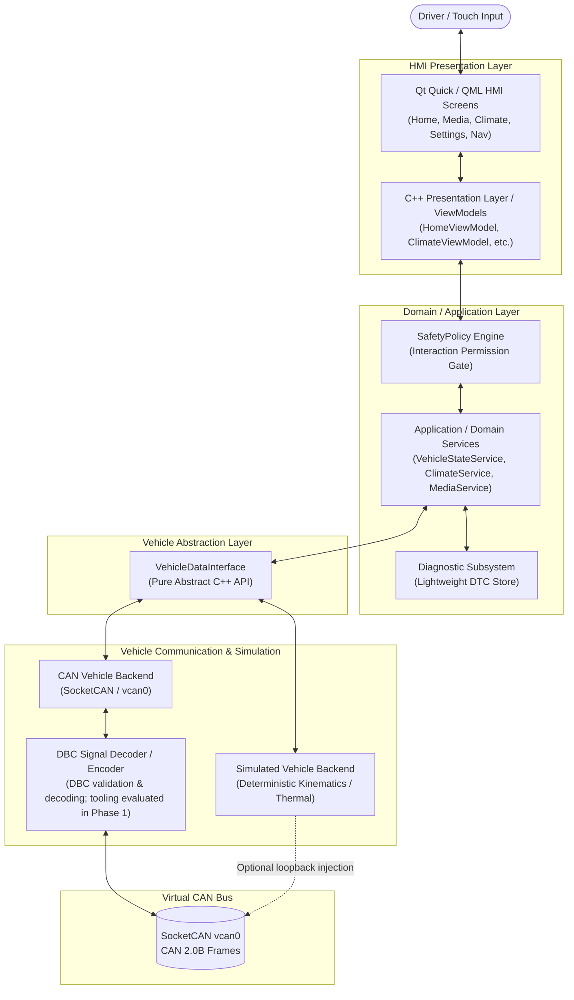
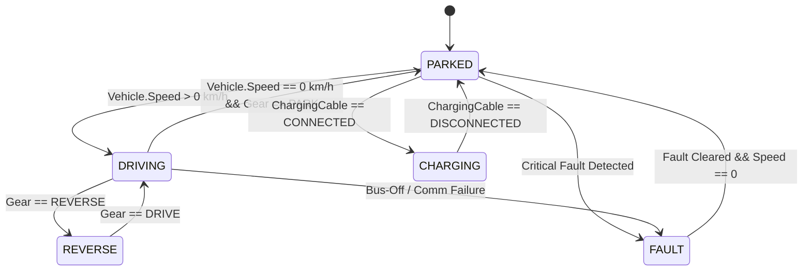

# DriveOS — Automotive IVI & Vehicle HMI
## Project Charter & Engineering Contract

---

### 1. Document Control & Metadata

| Attribute | Details |
| :--- | :--- |
| **Project Name** | **DriveOS — Automotive IVI & Vehicle HMI** |
| **Document Version** | 1.0.0 |
| **Status** | Approved — Phase 0 Baseline |
| **Lead Software Architect** | Lead Software Architect & Senior Automotive HMI Engineer |
| **Target Audience** | Engineering Leadership, Technical Recruiters, Automotive Software Reviewers |
| **Project Type** | Production-oriented automotive In-Vehicle Infotainment (IVI) & HMI prototype |

---

### 2. Project Identity & Disclaimer

#### 2.1 Project Purpose
DriveOS is an engineering portfolio project developed to demonstrate practical, production-oriented automotive software engineering capabilities. The project focuses on clean software architecture, modern C++ engineering, Qt/QML automotive HMI development, CAN bus communication, DBC-based signal decoding, vehicle state simulation, diagnostic fault handling, automated testing, and safety-aware UX design.

#### 2.2 Critical Regulatory & Compliance Disclaimer
> [!IMPORTANT]
> **DriveOS is a software engineering prototype and proof-of-concept.**
> It is **NOT** production-certified automotive software and does not operate on a physical production vehicle.
>
> Explicitly, this project **DOES NOT** claim compliance with or certification under:
> - **ISO 26262** (Road Vehicles — Functional Safety / ASIL)
> - **ISO/SAE 21434** (Road Vehicles — Cybersecurity Engineering)
> - **Automotive SPICE (ASPICE)** (Process Assessment Model)
> - **AUTOSAR** (Classic or Adaptive Platform Architecture)
> - **Production OEM/Tier-1 Homologation or Vehicle Certification**
>
> Instead, DriveOS demonstrates the *engineering principles, architectural decoupling, fault propagation patterns, defensive coding habits, and safety-aware design thinking* required when operating in such regulated environments.

---

### 3. Product Vision

DriveOS delivers a modern, high-performance touchscreen In-Vehicle Infotainment (IVI) and Human-Machine Interface (HMI) built with **C++** and **Qt 6 / QML**. The interface serves five primary touchscreen domains:
1. **Home:** System overview, real-time speed, battery state-of-charge (SOC), estimated range, drive mode, and quick status alerts.
2. **Media:** Audio playback controls, track metadata display, source selection, and volume management.
3. **Climate (HVAC):** Cabin and ambient temperature monitoring, target temperature regulation, fan speed control, and AC toggling.
4. **Vehicle Settings:** Exterior lighting modes, door lock state visualization, drive mode selection (Eco/Normal/Sport), and vehicle status configurations.
5. **Navigation (Conceptual):** Route visualization mockup, turn-by-turn guidance cues, and driving-state-constrained display behavior.

#### Architectural Vision
The visible touchscreen interface is merely the presentation layer of a much deeper, decoupled automotive software system. The overarching architecture strictly enforces unidirectional data flow and clean separation of concerns:



**Fundamental Rule:** The UI must never directly touch CAN frames, raw byte buffers, sockets, or simulation primitives.

---

### 4. Problem Statement

Modern automotive cockpits demand intuitive consumer-grade touchscreen user experiences while simultaneously interacting with real-time, safety-critical vehicle networks. Unlike generic desktop or web software, an automotive HMI must:
1. **Reflect Asynchronous Vehicle State:** Handle dynamic, continuous vehicle telemetry (speed, SOC, temperatures) without blocking the UI thread.
2. **Enforce Safety Constraints:** Dynamically restrict driver distraction by locking out complex interactions when the vehicle transitions from `PARKED` to `DRIVING`.
3. **Handle Degradation & Communication Loss:** Detect message timeouts, bus-off conditions, or ECU dropouts, and transition gracefully into deterministic fallback states rather than crashing or freezing.
4. **Surface Diagnostics Deterministically:** Capture Diagnostic Trouble Codes (DTCs) and communicate actionable alerts without panicking the driver.

DriveOS provides a structured software prototype that solves these problems cleanly using pure software abstraction and virtual CAN networks (`vcan0`), eliminating the need for expensive physical vehicle hardware.

---

### 5. Target Users & Stakeholders

| User / Role | Description & Needs | Primary Goal in DriveOS |
| :--- | :--- | :--- |
| **Driver (Primary UX Persona)** | The vehicle operator interacting with the touch display while parked or in motion. | Clear visual hierarchy, zero latency, glanceable telemetry, intuitive climate/media controls, unambiguous safety restrictions. |
| **Automotive Software Engineer** | Developer maintaining domain logic, CAN bus decoders, or state machines. | Clean C++ APIs, modular services, strict dependency inversion, testable abstractions. |
| **HMI / UI Developer** | Developer building QML views, transitions, and component styling. | Declarative QML, reactive ViewModel bindings, no backend or CAN logic leaking into QML. |
| **Test & Validation Engineer** | Engineer verifying requirements traceability, fault handling, and test coverage. | Mockable interfaces, fault injection harness, deterministic unit and integration test suites. |
| **Technical Recruiter / Hiring Lead** | Reviewer evaluating fresher candidates for automotive software engineering roles. | Objective evidence of architectural rigor, modern C++ conventions, CAN/SocketCAN proficiency, and professional engineering hygiene. |

> [!NOTE]
> The **Driver** is the sole target of the User Experience (UX). Recruiters are evaluators of the code and architecture, **not** the target of the UI. No gimmick features or non-automotive UI widgets are permitted.

---

### 6. Core User Journeys

#### Journey 1 — Vehicle Startup & Handshake
1. System receives `IgnitionState::ON` or startup signal.
2. DriveOS application runtime initializes; C++ domain services start up.
3. `VehicleDataInterface` establishes connection to vehicle bus / simulator.
4. Initial telemetry burst received and decoded via DBC.
5. Home screen displays active vehicle health, current battery SOC, range, and operational mode.

#### Journey 2 — Media Playback & Volume Control
1. Driver navigates from Home to Media screen via global navigation bar.
2. Media service reports available tracks and current playback state.
3. Driver taps Play/Pause or advances track; ViewModel emits intent to domain service.
4. Media state updates and reflects across both Media screen and Home summary card.
5. Driver returns to Home screen; audio playback state persists.

#### Journey 3 — Climate Regulation (HVAC)
1. Driver opens Climate screen.
2. Real-time cabin temperature and outside ambient temperature displayed from CAN signals.
3. Driver increments target cabin temperature (e.g., 20°C to 22°C) or toggles AC.
4. `ClimateService` validates setpoint boundaries and transmits updated setpoints via `VehicleDataInterface`.
5. Simulator/ECU acknowledges setpoint; UI confirms updated state.

#### Journey 4 — Vehicle Settings Modification (Parked vs. Driving)
1. Vehicle is in `PARKED` state.
2. Driver opens Vehicle Settings screen.
3. Driver alters exterior light configuration or toggles drive mode (`ECO`, `NORMAL`, `SPORT`).
4. Settings are validated by `SafetyPolicy`, committed to vehicle domain state, and reflected on UI.

#### Journey 5 — Safety-Aware Driving Interaction Restriction
1. Vehicle speed transitions from `0 km/h` to `> 0 km/h`; vehicle state changes to `DRIVING`.
2. `SafetyPolicy` detects state transition and broadcasts interaction policy update.
3. ViewModels re-evaluate property permissions:
   - Deep settings menus, complex text inputs, and distracting lists are disabled/locked.
   - Primary climate setpoints, essential media controls (next/prev/mute), and speed/range remain immediately accessible.
4. Touchscreen clearly displays a subtle non-intrusive safety banner ("Settings locked while vehicle is in motion").

#### Journey 6 — Vehicle Communication Failure & Graceful Degradation
1. CAN backend detects missed cyclic frames from powertrain ECU (timeout threshold exceeded).
2. `VehicleDataInterface` flags `COMMUNICATION_TIMEOUT` on speed and battery telemetry.
3. Domain layer marks telemetry attributes as `INVALID / STALE`.
4. UI replaces stale numerical values with fallback placeholders (`-- km/h`, `-- %`) and displays a non-blocking system alert icon.
5. HMI event loop remains fluid at 60 FPS; no freeze, crash, or memory spike occurs.
6. When communication recovers, valid telemetry automatically restores without requiring application restart.

#### Journey 7 — Diagnostic Fault Injection & DTC Handling
1. A fault condition is injected (e.g., Simulated Sensor Short Circuit / High Cabin Temp Anomaly).
2. Diagnostic subsystem logs Diagnostic Trouble Code (e.g., `DTC P0534 — A/C Refrigerant Charge Loss`).
3. Diagnostic service exposes DTC list to diagnostic view / service tool interface.
4. Driver HMI surfaces appropriate warning telltale (e.g., HVAC service required icon).
5. Diagnostic reset command clears DTC and restores normal telltale status.

---

### 7. Functional Scope Baseline

The core implementation scope is locked to the following 25 functional deliverables:

```
[A] Home Screen                   [N] DBC Signal Definitions
[B] Media Screen                  [O] can-utils Integration
[C] Climate (HVAC) Screen         [P] CAN / DBC Tooling Pipeline (Evaluated in Phase 1)
[D] Vehicle Settings Screen       [Q] Diagnostic Subsystem (Lightweight DTC)
[E] Navigation Screen (Mock)      [R] Fault Handling Logic
[F] Navigation Bar / App Router   [S] Fault Injection Mechanism
[G] MVVM Presentation Layer       [T] Unit Tests (GoogleTest)
[H] C++ Domain / Service Layer    [U] QML Tests (Qt Test)
[I] VehicleDataInterface API      [V] Static Analysis (clang-tidy, cppcheck)
[J] Vehicle Simulation Engine     [W] CI Pipeline (GitHub Actions)
[K] CAN Communication Backend     [X] Requirements Documentation
[L] SocketCAN Integration         [Y] Architecture & ADR Documentation
[M] vcan0 Virtual Network
```

---

### 8. Non-Functional Engineering Goals

1. **Responsiveness:** HMI UI thread must remain entirely decoupled from I/O and SocketCAN socket reading. UI rendering must target a smooth 60 FPS without frame drops caused by CAN processing.
2. **Modularity & Decoupling:** Complete architectural isolation between UI (QML), presentation (ViewModels), business logic (Domain Services), and low-level communication (SocketCAN/DBC).
3. **Testability:** Domain services, view models, safety policies, and CAN decoders must be testable in a headless CLI environment without starting a graphical display.
4. **Reliability & Determinism:** Graceful degradation on packet loss, frame corruptions, and bus timeouts. No unhandled exceptions, memory leaks, or undefined states.
5. **Observability:** Structured logging with configurable log categories (`driveos.hmi`, `driveos.can`, `driveos.diag`, `driveos.safety`).
6. **Code Quality:** Strict adherence to modern C++ conventions (RAII, smart pointers, `const`-correctness, zero raw memory ownership), formatted via `clang-format`, and verified by `clang-tidy`.
7. **Empirical Measurement Rule:** *Measure, never invent.* No fake latency, CPU, or startup metrics will ever be documented unless empirically measured on running software.

---

### 9. Architectural Principles

* **Principle 1 — UI Decoupling:** QML code must never parse CAN messages, access sockets, execute filesystem I/O, or contain business rules.
* **Principle 2 — Hardware Abstraction:** All vehicle data access flows through a pure virtual C++ interface (`VehicleDataInterface`). Backends (Simulation or SocketCAN) plug in transparently.
* **Principle 3 — Domain Logic in C++:** Presentation rules, boundary validations, unit conversions, and state transitions reside strictly in C++.
* **Principle 4 — Single Responsibility:** Highly focused components (`SpeedProvider`, `ClimateService`, `SafetyPolicy`) rather than monolithic "God classes" like `VehicleManager`.
* **Principle 5 — Testability First:** Business logic must be verified using unit test runners (`ctest`, `gtest`) without requiring X11/Wayland or physical hardware.
* **Principle 6 — No Fake Abstractions:** Every interface must serve an actual operational or testing requirement. No design patterns implemented purely for visual resume decoration.
* **Principle 7 — Defensive Fault Handling:** In an automotive context, silence or corrupted data is fatal. Missing data must be explicitly represented as `Stale` or `Invalid`.

---

### 10. Safety-Aware UX Architecture

Automotive user interfaces operate under human factors constraints defined by driving distraction guidelines (e.g., NHTSA, AAM). DriveOS demonstrates this architectural awareness through a centralized `SafetyPolicy` engine:



#### Interaction Policy Rules
| Vehicle State | Allowed Touchscreen Actions | Restricted Touchscreen Actions | HMI Feedback |
| :--- | :--- | :--- | :--- |
| **PARKED** | Full access to all menus, settings, detailed lists, media browsing. | None. | Normal UI presentation. |
| **DRIVING** | Essential climate setpoint adjustment, media next/prev/pause, mute, primary navigation view. | Deep settings, keyboard input, list scrolling > 4 items, manual pairing. | Visual lockout badge; non-distracting notification toast. |
| **REVERSE** | Proximity display / rearview screen priority; mute audio warning cues. | All non-critical settings and browsing. | Rearview overlay active. |
| **CHARGING** | Charging statistics, battery health, charge scheduling, climate preconditioning. | Drive mode selection, transmission settings. | Charging progress dashboard. |
| **FAULT** | Safe degraded display, diagnostic alert review, emergency controls. | High-performance drive modes, normal comfort automation if impaired. | Prominent yellow/red diagnostic telltale. |

---

### 11. Fault Handling & Propagation Architecture

Faults are treated as first-class architectural events. The system defines three categories of faults:
1. **Network Faults:** SocketCAN interface down, buffer overrun, bus-off state.
2. **Signal Telemetry Faults:** Timeout (missing cyclic heartbeat), cyclic jitter, out-of-range value, checksum mismatch.
3. **Subsystem Faults:** ECU reported DTC, sensor failure, thermal threshold exceeded.

#### Propagation Flow:
```
[CAN Frame Missing > 500ms]
       ↓
[CANVehicleBackend (Detects Timeout)]
       ↓
[VehicleDataInterface (Flags SignalStatus::STALE / INVALID)]
       ↓
[Domain Service (Evaluates Fallback Value & Emits Signal)]
       ↓
[ViewModel (Updates Property State & HasValidData Flag)]
       ↓
[QML HMI (Renders Fallback Visuals & Warning Badge)]
```

---

### 12. Testing Philosophy & Traceability

Testing follows a pragmatic V-model structure ensuring every requirement maps directly to verifiable code:

```
[Requirements (FR/NFR)] ─────────── Traceability ───────────> [System / HMI Tests]
        ↓                                                            ↑
  [System Design] ────────────── Verification ──────────────> [Integration Tests]
        ↓                                                            ↑
    [Module Design] ──────────── Unit Verification ─────────> [Unit Tests (GTest)]
        ↓                                                            ↑
      [Implementation (C++ / QML)] ──────────────────────────────────┘
```

* **Unit Tests (GoogleTest):** Verify DBC decoding algorithms, unit conversions, `SafetyPolicy` transition rules, and state machines.
* **Mocking (GoogleMock):** Mock `VehicleDataInterface` to simulate packet loss, erratic speeds, and fault states without launching virtual CAN.
* **HMI Verification (Qt Test):** Verify ViewModel property bindings, signal emission, and screen routing.
* **Automated Static Analysis:** `clang-format` ensures style uniformity; `clang-tidy` catches bug patterns, modernize rules, and memory issues.

---

### 13. Scope Boundaries & Future Extension

#### In-Scope for Core Implementation:
- Desktop/Linux virtual environment with Qt 6, C++20/17, SocketCAN (`vcan0`), and pure simulation fallback.
- Complete 5-screen HMI with responsive modern automotive aesthetic.
- Initial candidate vehicle signals defined in a clean `.dbc` file (strictly containing only signals required by implemented requirements).
- Deterministic vehicle simulator and fault injector.
- Comprehensive automated test suite and GitHub Actions CI.

#### Strictly Out-of-Scope (No "Keyword Bloat"):
To maintain software engineering integrity, the following technologies are **explicitly excluded** from the core project:
- Eclipse KUKSA / COVESA VSS
- Voice Assistants, Speech Recognition, Generative AI, Large Language Models
- Full AUTOSAR (Classic/Adaptive) stacks
- Android Automotive OS (AAOS)
- Full ISO 14229 UDS implementations (a lightweight in-memory DTC store is built)
- SOME/IP, DDS, or complex automotive Ethernet protocols
- Over-The-Air (OTA) update frameworks
- Yocto / Poky custom board builds

#### Future Extension (Post-Core Phase):
Once the pure software architecture is mature and verified on Linux/CI, an optional hardware integration may be introduced:
- Microcontroller (STM32 / ESP32) running Embedded C / FreeRTOS.
- Physical CAN transceiver (MCP2515 / TJA1050) bridging physical telemetry to a Linux host (Raspberry Pi or PC) over physical CAN.

---

### 14. Engineering Contract

As the engineering foundation of DriveOS, all future phases must strictly adhere to the following seventeen rules:

1. **Quality Over Feature Count:** A small, impeccably tested, decoupled system is vastly superior to a sprawling, brittle codebase.
2. **No Unnecessary Technologies:** Every library, protocol, and tool must have a concrete functional requirement. Never add dependencies for resume decoration.
3. **No Fake Metrics:** Latency, CPU utilization, frame rates, and memory footprints must only be reported if measured with verifiable tools.
4. **No Fake Compliance Claims:** Never claim ISO 26262, ASPICE, or AUTOSAR certification. Claim only relevant engineering practices.
5. **No Hard-Coded Vehicle Communication in UI:** QML must never parse frames, read sockets, or manipulate hardware data.
6. **No Raw CAN Decoding in Business Logic:** All CAN frame parsing belongs inside the DBC decoding abstraction layer.
7. **Domain Logic Belongs in C++:** QML is strictly a presentation and layout mechanism.
8. **All Core Logic Must Be Testable:** Business logic, state machines, and decoders must execute headlessly in automated tests.
9. **Faults Must Be Handled Explicitly:** Degraded states, timeouts, and corrupted inputs must have defined fallback behaviors.
10. **Requirements Must Trace to Tests:** Every functional requirement in `REQUIREMENTS.md` must link to an architectural component and a test case.
11. **Code Changes Must Be Reviewable:** Small, coherent commits accompanied by clean documentation.
12. **Prefer Simple Designs:** Choose the simplest architecture that completely and cleanly solves the problem.
13. **No Speculative Abstractions:** Do not create abstract factory hierarchies or complex design patterns without a proven technical need.
14. **No Scope Expansion Without Approval:** Stick strictly to the approved Phase deliverables.
15. **Gate-Controlled Phase Transitions:** No implementation phase may commence until the preceding phase meets its formal Definition of Done and receives explicit user approval.
16. **Filesystem and System Safety:** Do not modify filesystem permissions, ownership, ACLs, security policies, system configuration, virtualization settings, or operating-system configuration unless explicitly authorized by the user.
17. **Workspace Integrity:** Do not delete, recreate, move, or rename the project workspace unless explicitly authorized.
