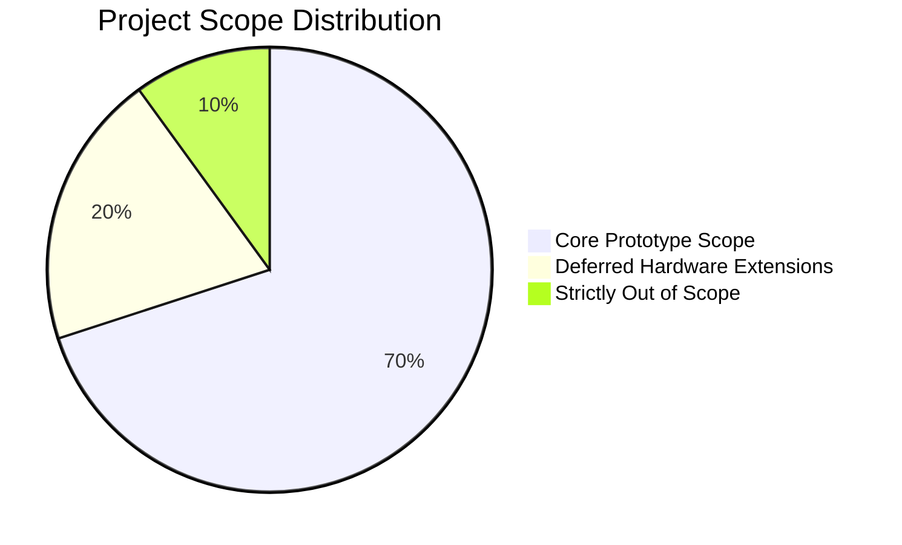
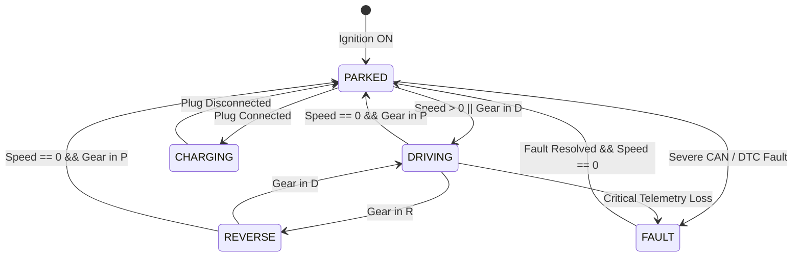

# DriveOS — Automotive IVI & Vehicle HMI
## Project Scope & Boundaries

---

### 1. Document Overview

This document defines the strict functional boundaries of **DriveOS**. To ensure high engineering quality, maintainability, and depth over superficial breadth, the project divides functionality into three explicit categories:
1. **CORE SCOPE (Mandatory for Current Baseline)**
2. **OPTIONAL FUTURE EXTENSIONS (Deferred Post-Baseline)**
3. **OUT OF SCOPE (Strictly Prohibited — Guardrail Integrity)**

---

### 2. Scope Categorization Matrix

#### 2.1 Category 1: CORE SCOPE (Mandatory)

The Core Scope constitutes the complete, self-contained software engineering deliverable:

* **HMI Presentation (Qt 6 / QML):**
  * Five primary touchscreen screens:
    1. **Home Screen:** Speedometer, battery SOC gauge, estimated range, gear indicator, quick alerts.
    2. **Media Screen:** Track metadata, playback state, track skipping, volume slider.
    3. **Climate Screen:** Dual-temperature readouts, setpoint controls, fan speed stepped selector, AC toggle.
    4. **Vehicle Settings Screen:** Door lock status, exterior lighting modes, drive mode toggle (Eco/Normal/Sport).
    5. **Navigation Screen (Mock):** Clean schematic situational display, mock turn indicator.
  * Responsive global application shell, status bar (clock, network status, battery badge), and bottom navigation bar.
  * Modern, automotive-grade dark aesthetic (deep slate, vibrant cyan/electric blue accents, crisp typography).

* **Architecture & Presentation Layer:**
  * Clean MVVM architecture (`HomeViewModel`, `ClimateViewModel`, `MediaViewModel`, `SettingsViewModel`).
  * Pure C++ domain services (`VehicleStateService`, `ClimateService`, `MediaService`, `SafetyPolicyEngine`).
  * `VehicleDataInterface` pure abstract C++ API.

* **Vehicle Communication & Signal Processing:**
  * Concrete `CANVehicleBackend` implementing `VehicleDataInterface` using Linux SocketCAN (`AF_CAN`).
  * Linux virtual CAN network (`vcan0`) configuration and integration scripts.
  * Official CAN Database specification file (`driveos.dbc`).
  * DBC decoding pipeline: `cantools` will be evaluated for DBC validation, signal inspection, decoding/tooling, and optional code generation. The final implementation approach will be selected during Phase 1 based on simplicity, maintainability, testability, and actual tool capabilities (no generated code introduced unless there is a clear engineering benefit).
  * Cyclic frame timeout detection and `SignalStatus` lifecycle management (`VALID`, `STALE`, `INVALID`).

* **Simulation & Fault Handling:**
  * Deterministic vehicle physics and kinematics simulator (speed acceleration curve, battery drain calculation).
  * Dual-mode simulation runner: In-process direct simulator and standalone external CAN broadcast daemon.
  * Software fault injection mechanism (cyclic frame timeout, out-of-range telemetry, bus disconnection).
  * Lightweight Diagnostic Subsystem: In-memory DTC store, active/inactive fault status reporting, fault clearing, and simulation fault injection.

* **Verification, Code Quality & CI:**
  * Automated unit tests with GoogleTest (GTest) and GoogleMock (GMock).
  * ViewModel binding tests with Qt Test.
  * Continuous Integration pipeline via GitHub Actions.
  * Static code analysis with `clang-tidy` and code formatting enforcement with `clang-format`.

---

#### 2.2 Category 2: OPTIONAL FUTURE EXTENSIONS (Deferred Post-Baseline)

These extensions are strictly forbidden during the core development phase. They may only be evaluated after all core deliverables and tests are fully verified and approved:

* **Physical Microcontroller ECU:**
  * Porting the vehicle simulator to an external **STM32** (ARM Cortex-M) or **ESP32** running Bare-Metal Embedded C or FreeRTOS.
* **Physical CAN Transceiver Integration:**
  * Connecting the microcontroller to a physical CAN transceiver (e.g., MCP2515 over SPI, or SN65HVD230 / TJA1050) communicating with a physical Linux host (e.g., Raspberry Pi 4/5) via a USB-CAN adapter or SPI CAN hat.
* **Persistent SQLite Database:**
  * Adding local SQLite storage for historical trip telemetry or diagnostic event logs if file-based serialization proves insufficient.

---

#### 2.3 Category 3: OUT OF SCOPE (Strictly Prohibited)

The following items are **explicitly excluded** to prevent superficial implementation, distraction, and architectural decay:

| Excluded Item | Justification for Exclusion |
| :--- | :--- |
| **Eclipse KUKSA / COVESA VSS** | High abstraction overhead; obscures low-level SocketCAN socket mechanics and DBC bit decoding. |
| **Cloud Voice Assistants / Conversational Agents** | Non-essential for core automotive cockpit systems; introduces heavy network/compute overhead and nondeterministic behavior. |
| **Android Automotive OS (AAOS)** | Monolithic OS footprint requiring massive system resources; hides C++ networking behind Java VHAL. |
| **Full AUTOSAR (Classic/Adaptive)** | Impossible to implement legitimately without licensed Tier-1 commercial toolchains (Vector, Elektrobit). |
| **Full ISO 14229 UDS Stack** | Hundreds of services, complex multi-frame ISO-TP transport; creates schedule risk without adding architectural value. |
| **SOME/IP / DDS / Automotive Ethernet** | Distinct domain protocol; out of scope for a vehicle CAN bus IVI prototype. |
| **Over-The-Air (OTA) Update System** | Requires cloud infrastructure, dual-partition bootloaders (A/B), and cryptographic signing unsuited for an HMI scope. |
| **Custom Yocto / Buildroot Linux Distribution** | Multi-hour build cycles and 100GB+ storage requirements distract from core C++/Qt software engineering. |
| **Cloud Backends / Microservices** | Completely orthogonal to embedded vehicle cockpit engineering. |

---

### 3. Vehicle Signal Scope

The vehicle signal set shall contain only signals required by implemented requirements. Signals may be added or removed when justified by actual functionality to avoid artificial vehicle complexity.

The following are the **initial candidate vehicle signals**, mapped directly to touchscreen features:

| # | Signal Name | Frame / Message | Range & Units | Scaling / Resolution | Consuming Feature / Screen | Justification |
| :---: | :--- | :--- | :--- | :--- | :--- | :--- |
| 1 | `Vehicle.Speed` | `Powertrain_Status` | 0 – 250 km/h | 0.1 km/h / bit | Home Screen, SafetyPolicy | Primary speedometer; triggers driving distraction lockout. |
| 2 | `Battery.SOC` | `Battery_Status` | 0 – 100 % | 0.5 % / bit | Home Screen, Charging Screen | Real-time state of charge gauge; triggers low-battery warnings. |
| 3 | `Vehicle.Range` | `Battery_Status` | 0 – 800 km | 1.0 km / bit | Home Screen | Estimated remaining distance calculated from SOC and consumption. |
| 4 | `CabinTemperature` | `Climate_Status` | -20.0 – 50.0 °C | 0.5 °C / bit | Climate Screen, Home Screen | Real-time interior temperature measured by cabin sensor. |
| 5 | `OutsideTemperature`| `Climate_Status` | -40.0 – 60.0 °C | 0.5 °C / bit | Climate Screen, Status Bar | Ambient exterior temperature for driver situational awareness. |
| 6 | `Climate.AC` | `Climate_Command` | 0 (Off), 1 (On) | 1 bit boolean | Climate Screen | Air conditioning compressor activation state. |
| 7 | `Climate.FanSpeed` | `Climate_Command` | 0 (Off) – 5 (Max)| 1 level / bit | Climate Screen | HVAC blower motor speed regulation. |
| 8 | `Climate.TargetTemp`| `Climate_Command` | 16.0 – 28.0 °C | 0.5 °C / bit | Climate Screen | Desired cabin temperature setpoint set by driver. |
| 9 | `DriveMode` | `Vehicle_Config` | 0:ECO, 1:NORMAL, 2:SPORT | 2 bits enum | Settings Screen, Home Screen | Vehicle powertrain dynamic response profile. |
| 10 | `DoorState` | `Body_Status` | 4-bit bitmask (FL, FR, RL, RR) | 1 bit / door | Settings Screen, Home Screen | Open/closed status of cabin doors for driver safety. |
| 11 | `ChargingState` | `Battery_Status` | 0:DISCONNECTED, 1:CONNECTED, 2:CHARGING | 2 bits enum | Home Screen, Charging View | Visual indicator of EV plug connection and power transfer. |
| 12 | `IgnitionState` | `Vehicle_Config` | 0:OFF, 1:ACC, 2:ON | 2 bits enum | Lifecycle Manager | Controls system power state and screen wake/sleep transitions. |

> [!NOTE]
> The vehicle signal set shall contain only signals required by implemented requirements. Signals may be added or removed when justified by actual functionality. Avoid artificial vehicle complexity.

---

### 4. Vehicle State Model & Behavioral Policy

The system evaluates vehicle operational context through a discrete state model:

#### State Definitions & HMI Interaction Rules:
1. **`PARKED` State:**
   - *Condition:* Vehicle speed is strictly 0 km/h, and transmission gear is in `PARK`.
   - *HMI Policy:* Unrestricted. Full access to detailed settings, system diagnostics, configuration lists, and media browsing.
2. **`DRIVING` State:**
   - *Condition:* Vehicle speed > 0 km/h or transmission gear is in `DRIVE`.
   - *HMI Policy:* Restricted Driver Distraction Mode. Deep settings tabs, complex text entry, and long list views are disabled. Primary glanceable telemetry (speed, range, active navigation cue) and immediate tactile controls (climate target step, volume mute/skip) remain fully responsive.
3. **`REVERSE` State:**
   - *Condition:* Transmission gear is in `REVERSE`.
   - *HMI Policy:* Reversing priority. Touch interactions across media/settings are suppressed; proximity alerts or camera viewport takes precedence.
4. **`CHARGING` State:**
   - *Condition:* Vehicle plug is engaged (`ChargingState::CHARGING`).
   - *HMI Policy:* Stationary charging dashboard. Displays charge power (kW), time to complete, target charge limit slider, and climate preconditioning controls.
5. **`FAULT` State:**
   - *Condition:* Bus communication failure (timeout > 500ms) or critical powertrain DTC registered.
   - *HMI Policy:* Graceful degradation. Stale data indicators replace missing telemetry; non-critical controls lock down; persistent diagnostic telltale alerts driver to seek service.
